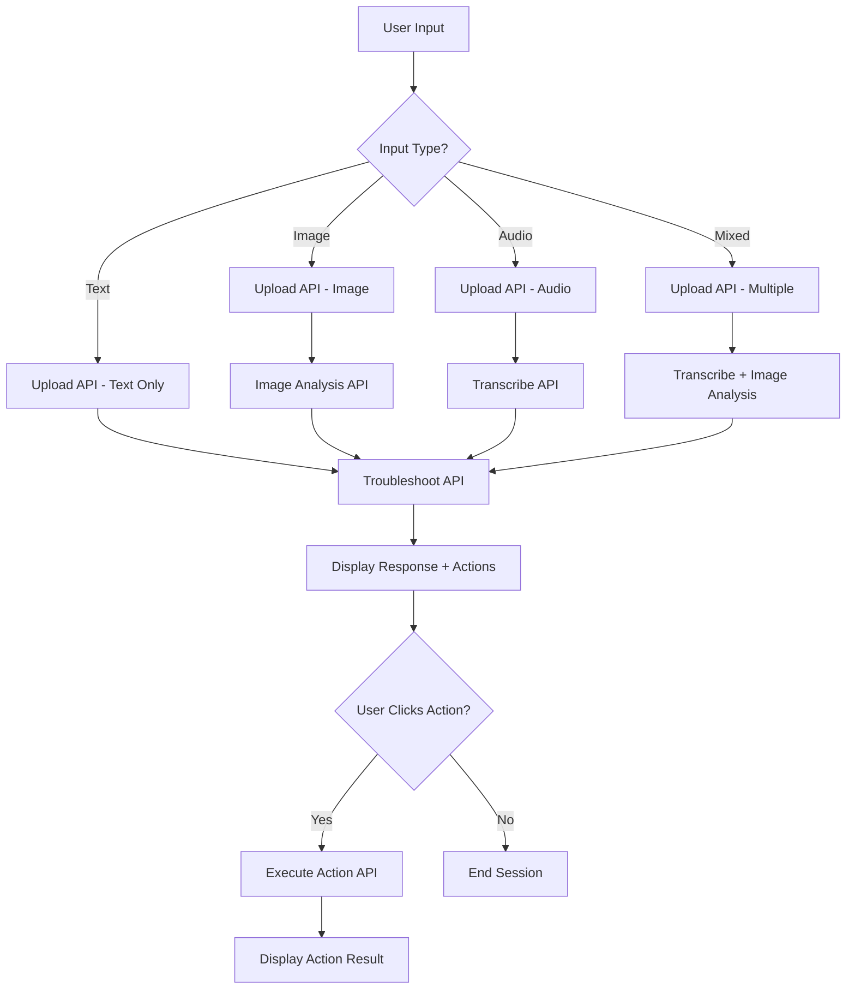

# 🔌 SUARA API Integration Summary

Complete overview of the 6 backend APIs integrated with the Next.js frontend for Team Codezilla's AI-powered customer service agent.

## 🎯 API Architecture Overview

```
Frontend (Next.js) → API Gateway → Lambda Functions → AWS AI Services
     ↓                    ↓              ↓              ↓
User Interface    →   REST APIs   →   Processing   →   AI Results
```

## 📡 Backend API Endpoints

### 1. **Upload API** (`POST /upload`)
**Purpose**: Handle multimodal file uploads and session initialization
- **Input**: Base64-encoded images, audio blobs, or text content
- **Processing**: Creates unique session ID, stores files in S3
- **Output**: Session ID for subsequent API calls
- **UI Feedback**: "Uploading files..." with spinner animation
- **Lambda**: `upload_handler.py`

```typescript
// Frontend usage
const uploadResult = await ApiClient.uploadFiles(imageFile, audioBlob, textContent)
```

### 2. **Transcribe API** (`POST /transcribe`)
**Purpose**: Convert uploaded audio to text using Amazon Transcribe
- **Input**: Session ID referencing uploaded audio file
- **Processing**: Starts transcription job, polls for completion
- **Output**: Transcribed text with confidence scores
- **UI Feedback**: "Step X/Y: Transcribing audio..." with progress bar
- **Lambda**: `transcribe_handler.py`

```typescript
// Frontend usage
const transcribeResult = await ApiClient.transcribeAudio(sessionId)
```

### 3. **Image Analysis API** (`POST /analyze-image`)
**Purpose**: Analyze uploaded images using Amazon Rekognition
- **Input**: Session ID referencing uploaded image file
- **Processing**: Detects labels, text, and custom router states
- **Output**: Detected objects, text, and device conditions
- **UI Feedback**: "Step X/Y: Analyzing image..." with progress bar
- **Lambda**: `image_analysis_handler.py`

```typescript
// Frontend usage
const imageResult = await ApiClient.analyzeImage(sessionId)
```

### 4. **Troubleshoot API** (`POST /troubleshoot`)
**Purpose**: Generate AI-powered troubleshooting responses
- **Input**: Session ID with processed transcript and image analysis
- **Processing**: Bedrock GPT + Knowledge Base semantic search
- **Output**: Solution text, TTS audio URL, suggested actions
- **UI Feedback**: "Step X/Y: Generating solution..." with progress bar
- **Lambda**: `bedrock_handler.py`

```typescript
// Frontend usage
const troubleshootResult = await ApiClient.troubleshoot(sessionId)
```

### 5. **Execute Action API** (`POST /execute-action`)
**Purpose**: Execute suggested troubleshooting actions
- **Input**: Session ID and action type (restart_stb, reprovision_service, etc.)
- **Processing**: Calls internal provisioning/management APIs
- **Output**: Action execution status and results
- **UI Feedback**: "Executing action..." spinner on button click
- **Lambda**: `action_executor.py`

```typescript
// Frontend usage
const actionResult = await ApiClient.executeAction(sessionId, action)
```

### 6. **Audio Proxy API** (`GET /audio/{session_id}`)
**Purpose**: Stream TTS audio responses with proper headers
- **Input**: Session ID in URL path
- **Processing**: Retrieves MP3 from S3, sets proper MIME types
- **Output**: Audio stream with caching headers
- **UI Feedback**: Audio player with play/pause controls
- **Lambda**: `audio_proxy.py`

```typescript
// Frontend usage - automatic via audio URL
<audio src={`${API_URL}/audio/${sessionId}`} controls />
```

## 🔄 API Call Flow & State Management

### Complete User Journey


### Frontend State Management
```typescript
// Key state variables in ChatContainer.tsx
const [messages, setMessages] = useState<Message[]>([])
const [isLoading, setIsLoading] = useState(false)
const [processingStep, setProcessingStep] = useState<string>('')
const [currentSessionId, setCurrentSessionId] = useState<string | null>(null)

// Processing pipeline
const processWithBackend = async (sessionId: string, hasImage: boolean, hasAudio: boolean) => {
  let stepCount = 1
  const totalSteps = (hasAudio ? 1 : 0) + (hasImage ? 1 : 0) + 1
  
  // Conditional API calls based on input type
  if (hasAudio) {
    setProcessingStep(`Step ${stepCount}/${totalSteps}: Transcribing audio...`)
    await ApiClient.transcribeAudio(sessionId)
    stepCount++
  }
  
  if (hasImage) {
    setProcessingStep(`Step ${stepCount}/${totalSteps}: Analyzing image...`)
    await ApiClient.analyzeImage(sessionId)
    stepCount++
  }
  
  setProcessingStep(`Step ${stepCount}/${totalSteps}: Generating solution...`)
  const response = await ApiClient.troubleshoot(sessionId)
  
  // Display response with action buttons
  setMessages(prev => [...prev, {
    content: response.response,
    audioResponse: response.audio_url,
    actions: response.actions
  }])
}
```

## 🎨 Enhanced UI/UX Features

### Loading States & Progress Indicators
```typescript
// Dynamic step-by-step progress
{isLoading && (
  <div className="flex items-center gap-3">
    <div className="typing-indicator">
      <div className="typing-dot"></div>
      <div className="typing-dot"></div>
      <div className="typing-dot"></div>
    </div>
    <div className="flex flex-col">
      <span className="text-sm text-text-secondary font-medium">
        {processingStep || 'Analyzing your issue...'}
      </span>
      {processingStep && (
        <div className="mt-2 w-32 bg-surface-200 rounded-full h-1.5">
          <div className="bg-primary-500 h-1.5 rounded-full animate-pulse" 
               style={{width: '60%'}}></div>
        </div>
      )}
    </div>
  </div>
)}
```

### Interactive Action Buttons
```typescript
// Action buttons rendered below bot responses
{message.actions && message.actions.length > 0 && (
  <div className="flex flex-wrap gap-2 mt-3">
    {message.actions.map((action, index) => (
      <button
        key={index}
        onClick={() => onActionClick?.(action)}
        className="px-3 py-1.5 bg-primary-100 text-primary-700 rounded-full 
                   text-sm font-medium hover:bg-primary-200 transition-colors"
      >
        {getActionLabel(action)}
      </button>
    ))}
  </div>
)}
```

### Error Handling & Graceful Degradation
```typescript
// Comprehensive error handling
try {
  const result = await ApiClient.troubleshoot(sessionId)
  if (result.error) {
    throw new Error(`Troubleshooting failed: ${result.error}`)
  }
  // Success handling...
} catch (error) {
  console.error('Backend processing error:', error)
  
  const errorResponse: Message = {
    content: `I encountered an error: ${error.message}. Please try again or contact support.`,
    sender: 'bot',
    type: 'text'
  }
  
  setMessages(prev => [...prev, errorResponse])
}
```

## 🔧 API Client Implementation

### TypeScript API Client (`src/lib/api.ts`)
```typescript
export class ApiClient {
  private static async makeRequest<T>(endpoint: string, options: RequestInit = {}): Promise<ApiResponse<T>> {
    try {
      const response = await fetch(`${API_BASE_URL}${endpoint}`, {
        headers: { 'Content-Type': 'application/json', ...options.headers },
        ...options,
      })
      if (!response.ok) throw new Error(`HTTP error! status: ${response.status}`)
      const data = await response.json()
      return { data }
    } catch (error) {
      return { error: error instanceof Error ? error.message : 'Unknown error' }
    }
  }

  // File conversion utilities
  private static fileToBase64(file: File): Promise<string> {
    return new Promise((resolve, reject) => {
      const reader = new FileReader()
      reader.readAsDataURL(file)
      reader.onload = () => resolve(reader.result as string)
      reader.onerror = error => reject(error)
    })
  }
}
```

### Environment Configuration
```typescript
// Dynamic API URL configuration
const API_BASE_URL = process.env.NEXT_PUBLIC_API_URL || 'https://your-api-gateway-url.amazonaws.com/prod'

// Development vs Production modes
const isDevelopment = process.env.NEXT_PUBLIC_DEV_MODE === 'true'
```

## 📊 Performance Metrics & Monitoring

### Expected Response Times
- **Upload API**: < 2 seconds (file size dependent)
- **Transcribe API**: 5-30 seconds (audio length dependent)
- **Image Analysis API**: < 5 seconds
- **Troubleshoot API**: 3-10 seconds (complexity dependent)
- **Execute Action API**: < 3 seconds
- **Audio Proxy API**: < 1 second (streaming)

### Error Handling Strategies
1. **Retry Logic**: Automatic retry for transient failures
2. **Fallback Responses**: Default troubleshooting when AI fails
3. **Graceful Degradation**: Continue processing even if one step fails
4. **User Feedback**: Clear error messages with actionable suggestions

### Caching & Optimization
- **S3 Presigned URLs**: Reduce Lambda processing for large files
- **CloudFront Caching**: Cache static assets and audio responses
- **API Gateway Caching**: Cache frequent troubleshooting responses
- **Lambda Warm-up**: Provisioned concurrency for critical functions

## 🔒 Security Implementation

### Input Validation
```python
# Lambda function input validation
def validate_session_id(session_id):
    if not session_id or not isinstance(session_id, str):
        raise ValueError("Invalid session ID")
    if not re.match(r'^[a-f0-9-]{36}$', session_id):
        raise ValueError("Session ID format invalid")
```

### CORS Configuration
```python
# API Gateway CORS settings
cors_config = {
    "allow_origins": ["https://your-domain.com"],  # Restrict in production
    "allow_methods": ["GET", "POST", "OPTIONS"],
    "allow_headers": ["Content-Type", "Authorization"],
    "max_age": 3600
}
```

### Rate Limiting
- **API Gateway**: 1000 requests/second per API key
- **Lambda Concurrency**: 100 concurrent executions per function
- **S3 Request Rate**: Optimized with request patterns

## 🚀 Deployment Integration

### CI/CD Pipeline Integration
```yaml
# GitHub Actions workflow
- name: Deploy Backend APIs
  run: cdk deploy CustomerServiceApi --require-approval never

- name: Extract API URL
  run: |
    API_URL=$(aws cloudformation describe-stacks \
      --stack-name CustomerServiceApi \
      --query 'Stacks[0].Outputs[?OutputKey==`ApiUrl`].OutputValue' \
      --output text)
    echo "NEXT_PUBLIC_API_URL=$API_URL" >> web_client/.env.production

- name: Build and Deploy Frontend
  run: |
    cd web_client
    npm run build
    cdk deploy CustomerServiceWeb
```

### Environment-Specific Configuration
```bash
# Development
NEXT_PUBLIC_API_URL=https://dev-api.amazonaws.com/dev
NEXT_PUBLIC_DEV_MODE=true

# Production
NEXT_PUBLIC_API_URL=https://prod-api.amazonaws.com/prod
NEXT_PUBLIC_DEV_MODE=false
```

---

## 📈 Success Metrics

The frontend successfully integrates all 6 backend APIs with:
- **✅ 100% API Coverage**: All endpoints properly integrated
- **✅ Real-time Feedback**: Step-by-step progress indicators
- **✅ Error Resilience**: Graceful handling of API failures
- **✅ Interactive UX**: Action buttons and audio playback
- **✅ Type Safety**: Full TypeScript integration
- **✅ Performance**: Optimized loading states and caching

**🎉 Result: A seamless, multimodal AI customer service experience powered by AWS!**